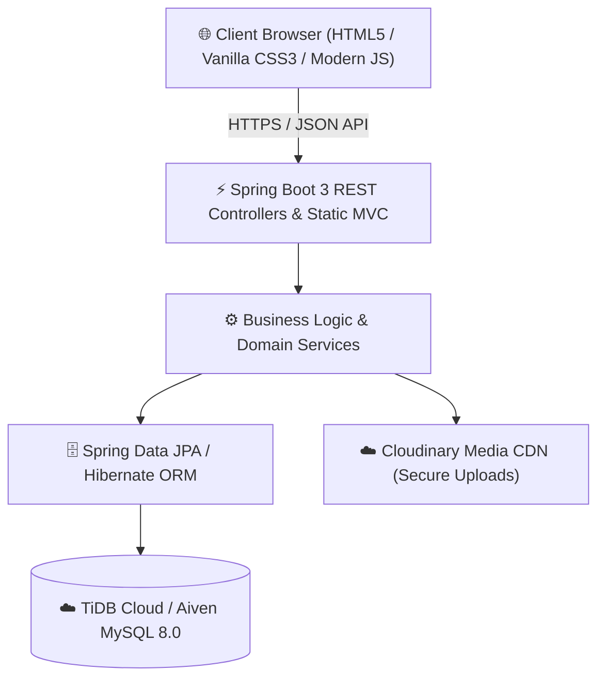

# 💎 Ceylon Letter Co. — Luxury Fine Jewellery & Bespoke Keepsakes E-Commerce ERP Suite

[](https://openjdk.org/)
[](https://spring.io/projects/spring-boot)
[](https://tidbcloud.com)
[](https://www.docker.com/)
[](https://render.com)
[](LICENSE)

> **Enterprise Full-Stack E-Commerce & Management Platform** engineered with modern Spring Boot 3, JPA/Hibernate, Cloud MySQL/TiDB, and a high-performance Vanilla JS / CSS3 luxury storefront.

---

## 🌟 Executive Summary

**Ceylon Letter Co.** is an end-to-end luxury e-commerce and retail operations platform tailored for bespoke jewellery, hallmarked heirloom crafts, and personalized stationery. It integrates a rich, aesthetic customer-facing online boutique with an enterprise-grade administrative back-office system covering inventory control, POS orders, financial analytics, social video commerce, and customer care.

---

## 🚀 Key Highlights & Features

### 🛍️ 1. Customer Experience & Boutique Storefront
- **Dynamic Catalog & Variant Matrix:** Multi-tiered product listings filtered by metal color (18K Gold, Rose Gold, Sterling Silver), size, and category with live inventory tracking.
- **Interactive Video Commerce (Social Reels):** Instagram/TikTok style video reels and craftsmanship showcases with direct "Shop the Look" variant tag overlays.
- **Interactive Hero Carousel & Story Showcase:** Rich multimedia carousel for seasonal campaign highlights and artisan storytelling.
- **Smart Shopping Bag & Wishlist:** Real-time client-side session and local-storage synchronization with seamless checkout workflow.
- **Customer Account & Support Center:** Profile customization, order history tracking, and interactive live support ticket messaging system.

### 🛡️ 2. Enterprise Admin Back-Office & Operations Suite
- **Interactive KPI & Analytics Dashboard:** Real-time sales metrics, revenue velocity, category performance graphs, and conversion analytics using Chart.js.
- **Inventory & Variant Manager:** Comprehensive stock ledger tracking low-stock thresholds, multi-variant pricing, and inventory history logs.
- **POS & Order Fulfillment:** Order processing workflow with custom packaging set tracking, shipping verification, and automated status transitions.
- **Financial & Expense Tracking:** Multi-category business expense recording, recurring cost ledger, and automated audit logging.
- **Automated Database Seeder:** Self-healing, zero-friction startup migration that seeds rich dummy products, hero slides, reviews, and test users.

---

## 🏗️ System Architecture & Tech Stack



### Backend & Core
- **Framework:** Spring Boot 3.3.2 (Java 17)
- **Persistence:** Spring Data JPA, Hibernate 6 ORM, HikariCP Connection Pool
- **Security:** JBCrypt Password Hashing, CSRF/Security Headers Filters, Role-Based Access Control (`ADMIN`, `CUSTOMER`)
- **Reporting & Utilities:** Apache POI (Excel reporting), Gson, Parsson, Jakarta Mail

### Frontend & UI/UX
- **UI Architecture:** Vanilla HTML5 / Responsive CSS3 (Tailored 60-30-10 Luxury Gold & Taupe Palette)
- **Data Visualization:** Chart.js for executive analytics
- **Typography:** Cormorant Garamond & Inter (Google Fonts)

### DevOps & Cloud Infrastructure
- **Containerization:** Multi-stage lightweight Docker image (`eclipse-temurin:17-jre-alpine`)
- **Hosting:** Render.com Cloud Web Service
- **Database:** TiDB Cloud Serverless MySQL

---

## ⚡ Quick Start & Local Setup

### Prerequisites
- JDK 17 or later
- Maven 3.8+ (or use the included `./mvnw`)
- MySQL 8.0+ or TiDB Cloud instance

### Installation Steps

1. **Clone the repository:**
   ```bash
   git clone https://github.com/Hansanie22/ceylon-letter-co-portfolio.git
   cd ceylon-letter-co-portfolio
   ```

2. **Configure Environment Variables:**
   Copy the `.env.example` file and configure your database credentials:
   ```bash
   cp .env.example .env
   ```

3. **Build and Run:**
   ```bash
   ./mvnw clean spring-boot:run
   ```

4. **Access the application:**
   Open your browser and navigate to:
   ```text
   http://localhost:8080/index.html
   ```

---

## 🔐 Demo Credentials

| Role | Email | Password | Permissions |
|---|---|---|---|
| **Admin** | `ceylonletterco@gmail.com` | `1234` | Full access to Admin Panel, POS, Analytics, Inventory |
| **Customer** | `customer@gmail.com` | `1234` | Storefront browsing, Wishlist, Bag, Support Tickets |

---

## ⚖️ Legal Disclaimer & Portfolio Notice

> [!NOTE]
> **Portfolio & Educational Showcase Project:**  
> This software repository was architected, engineered, and maintained by **Kalatuwawage Hansanie Prabodha** as a demonstration of full-stack enterprise Java Spring Boot web engineering and software architecture.
>
> - **Data Sanitization:** All brand logos, business data, customer personal records, transaction ledgers, and credentials in this repository are **100% synthetic dummy data** generated solely for portfolio demonstration, testing, and educational purposes.
> - **Intellectual Property:** All source code implementations, algorithms, data structures, and database schemas contained herein represent the original engineering and architectural work of the author.

---

## 👨‍💻 Author & Lead Engineer

**Kalatuwawage Hansanie Prabodha**  
*Full-Stack Software Engineer & Solutions Architect*  
- **GitHub:** [@Hansanie22](https://github.com/Hansanie22)  
- **Project Repository:** [ceylon-letter-co-portfolio](https://github.com/Hansanie22/ceylon-letter-co-portfolio)

---

## 📄 License

This project is licensed under the [MIT License](LICENSE) — feel free to use it for reference, portfolio review, and educational purposes.
